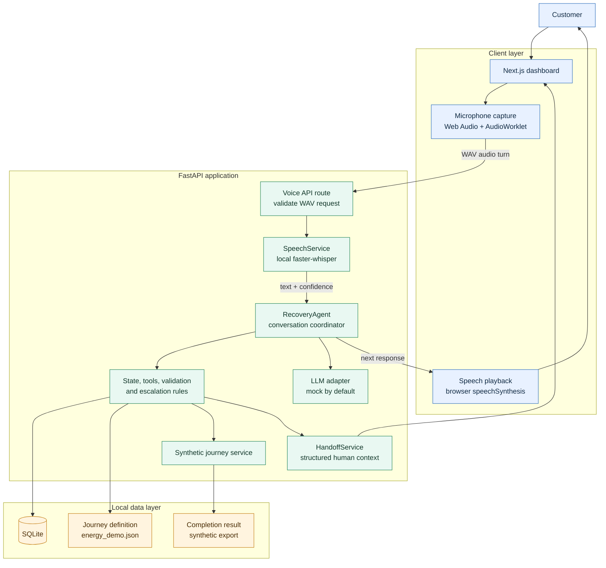
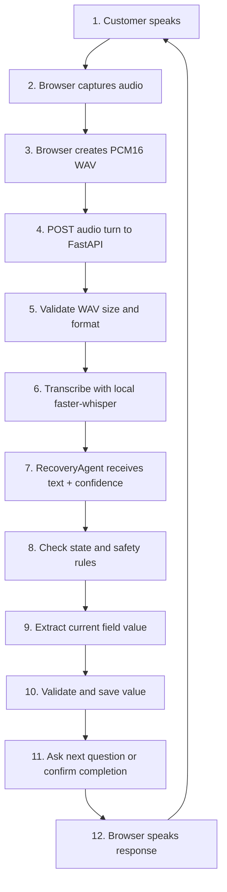
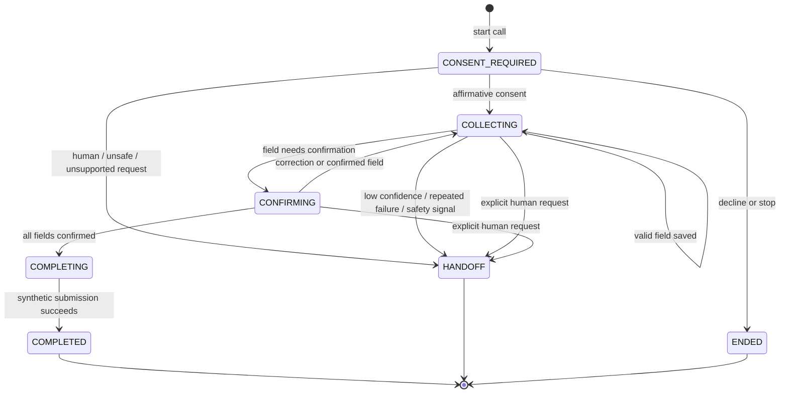
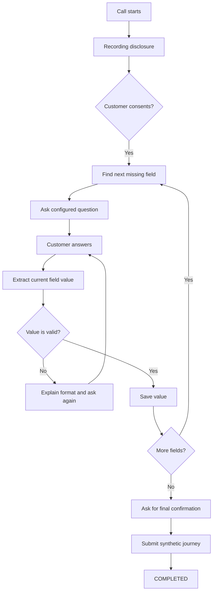
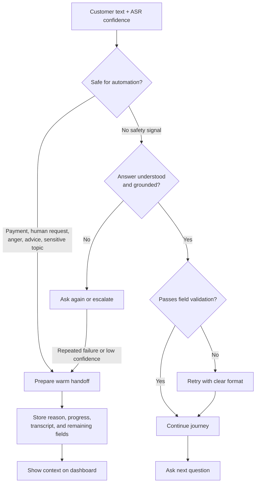

# Energy Recovery Voice Agent

> A local, voice-first prototype for recovering unfinished Energy comparison journeys.

The agent starts with a synthetic dropped-off lead, obtains consent, asks only for the missing journey fields, validates each answer, and completes the local demo journey. When the conversation is unsafe, unsupported, uncertain, or the customer requests help, it stops automation and prepares a warm handoff with context.

**This is a synthetic local prototype.** It does not use real CIMET customer records, place real phone calls, save production recordings, or connect to a live human-transfer platform.

## Highlights

- Consent-first recovery flow.
- State-driven question order and journey progress.
- Browser microphone capture with Web Audio and `AudioWorklet`.
- Local speech-to-text with `faster-whisper`.
- Deterministic mock LLM by default, with an optional OpenAI adapter.
- Field extraction followed by backend validation and persistence.
- Payment/card detection with redaction and escalation.
- DNC checks and respectful handling of “not interested”.
- Warm handoff context containing progress, remaining fields, reason, and transcript.
- Synthetic CLI scenarios and browser-level voice tests.

## Explore The System

| Area                     | Start here                                                                             |
| ------------------------ | -------------------------------------------------------------------------------------- |
| Browser voice capture    | [`apps/web/lib/voice-session.ts`](apps/web/lib/voice-session.ts)                       |
| Dashboard                | [`apps/web/app/page.tsx`](apps/web/app/page.tsx)                                       |
| API composition root     | [`apps/api/app/main.py`](apps/api/app/main.py)                                         |
| Conversation engine      | [`apps/api/app/agent/agent.py`](apps/api/app/agent/agent.py)                           |
| State and validation     | [`apps/api/app/agent/state.py`](apps/api/app/agent/state.py)                           |
| Escalation and redaction | [`apps/api/app/agent/escalation.py`](apps/api/app/agent/escalation.py)                 |
| Handoff context          | [`apps/api/app/services/handoff_service.py`](apps/api/app/services/handoff_service.py) |
| Synthetic journey        | [`data/journeys/energy_demo.json`](data/journeys/energy_demo.json)                     |

The diagrams below are rendered by GitHub. The expandable sections keep the README easy to scan while allowing a deeper technical walkthrough.

## Architecture



<details>
<summary><strong>Read the architecture from left to right</strong></summary>

1. The customer speaks through the Next.js dashboard.
2. The browser captures a WAV turn and sends it to the FastAPI voice route.
3. `SpeechService` returns text and confidence from local `faster-whisper`.
4. `RecoveryAgent` coordinates state, extraction, validation, escalation, and response.
5. SQLite stores the call and the dashboard displays progress or handoff context.

</details>

The browser owns microphone capture and speech playback. FastAPI owns the call lifecycle. The AI/model layer helps understand language, while deterministic backend code controls consent, field order, validation, payment safety, DNC, completion, and escalation.

## Quick Start

### Requirements

- Python 3.11+ recommended.
- Node.js and npm.
- A local `faster-whisper` model available to the Python environment for live voice transcription.
- A browser with microphone permission for voice mode.

### 1. Install backend dependencies

From the repository root:

```bash
python3 -m venv .venv
.venv/bin/python -m pip install -r apps/api/requirements.txt
```

### 2. Seed synthetic data

```bash
PYTHONPATH=apps/api .venv/bin/python -m app.seed
```

### 3. Start FastAPI

In terminal 1:

```bash
PYTHONPATH=apps/api .venv/bin/python -m uvicorn app.main:app \
	--app-dir apps/api --host 127.0.0.1 --port 8000
```

### 4. Install and start the dashboard

In terminal 2:

```bash
npm --prefix apps/web ci
npm --prefix apps/web run dev
```

Open the dashboard at **http://127.0.0.1:3000**.

Useful endpoints:

- Dashboard: http://127.0.0.1:3000
- API documentation: http://127.0.0.1:8000/docs
- Health check: http://127.0.0.1:8000/health

The web app uses a same-origin `/backend` proxy to reach FastAPI. The proxy target can be changed with `apps/web/.env.local`:

```env
API_INTERNAL_URL=http://127.0.0.1:8000
NEXT_PUBLIC_API_BASE_URL=/backend
```

## Run Scripted Scenarios

Run one scenario:

```bash
PYTHONPATH=apps/api .venv/bin/python -m app.demo --scenario happy_path
```

Run every scenario:

```bash
PYTHONPATH=apps/api .venv/bin/python -m app.demo --scripted
```

Available scenarios:

| Scenario                    | Demonstrates                                      |
| --------------------------- | ------------------------------------------------- |
| `happy_path`                | Consent, collection, confirmation, and completion |
| `frustrated`                | Frustration and escalation                        |
| `human_request`             | Explicit request for a person                     |
| `payment`                   | Card/payment guardrail                            |
| `not_interested`            | Respectful decline and DNC behavior               |
| `repeated_misunderstanding` | Repeated failed extraction and handoff            |
| `off_script`                | Unsupported question handling                     |
| `low_confidence`            | Uncertain answer handling                         |
| `dnc`                       | Blocked lead before call start                    |

## End-To-End Voice Flow



<details>
<summary><strong>What happens when something goes wrong?</strong></summary>

The same flow can exit early. A human request, payment language, anger, unsupported advice request, sensitive topic, repeated misunderstanding, or low confidence moves the call to `HANDOFF`. The backend creates a deterministic context and the dashboard shows the reason, transcript, collected fields, and remaining fields.

</details>

## Conversation State Flow



<details>
<summary><strong>Why the state flow matters</strong></summary>

The model does not get to skip from speech directly to completion. Consent, field order, validation, confirmation, and terminal states are guarded by `ConversationState` and the backend agent.

</details>

## Decision Flows

### Normal completion path



### Safety and escalation path



The normal path explains how a suitable call completes. The safety path explains how the system stops automation instead of guessing or forcing the customer to continue.

The voice flow is designed for local demonstration. It is not a replacement for production telephony, identity, payment, compliance, or human-transfer integrations.

## Safety Boundaries

- Consent is required before collecting journey data.
- Payment and card information are not collected as journey fields.
- Sensitive content is redacted where required and escalated.
- Advice and unsupported questions are outside the recovery script.
- “Not interested” and stop requests end the conversation.
- Low confidence and repeated misunderstanding can trigger a handoff.
- The backend rejects invalid values and does not save guessed facts.
- Handoff context is prepared locally; it is not sent to a live operator system.

## Project Layout

```text
apps/api/
	app/
		agent/          Conversation state, extraction, escalation, and tools
		adapters/       LLM, voice, and journey-provider adapters
		db/             SQLite schema and persistence
		routes/         FastAPI endpoints
		services/       Speech, journey, lead, handoff, and scenario services
		tests/          Backend tests

apps/web/
	app/              Next.js dashboard and UI components
	lib/              API client and browser voice session
	public/           AudioWorklet used by microphone capture
	tests/            Playwright voice tests

data/
	journeys/         Synthetic journey configuration
	transcripts/       Synthetic scripted conversations
	leads.json        Synthetic lead records
```

Important files:

- `apps/api/app/agent/agent.py` — main recovery conversation logic.
- `apps/api/app/agent/state.py` — guarded state transitions and validation.
- `apps/api/app/agent/escalation.py` — escalation and transcript-redaction rules.
- `apps/api/app/services/handoff_service.py` — deterministic handoff context.
- `apps/api/app/services/speech_service.py` — local WAV validation and Whisper transcription.
- `apps/web/lib/voice-session.ts` — browser capture, silence segmentation, upload, and playback.
- `data/journeys/energy_demo.json` — synthetic field order, questions, choices, and branches.

## Configuration

The backend reads environment variables through `Settings` in `apps/api/app/config.py`.

| Setting            | Default                 | Meaning                                       |
| ------------------ | ----------------------- | --------------------------------------------- |
| `DATABASE_URL`     | `sqlite:///./cimet.db`  | Local SQLite database                         |
| `LLM_PROVIDER`     | `mock`                  | Deterministic extractor; `openai` is optional |
| `OPENAI_API_KEY`   | empty                   | Required only for the OpenAI adapter          |
| `OPENAI_MODEL`     | `gpt-4o-mini`           | OpenAI model name when enabled                |
| `VOICE_PROVIDER`   | `browser`               | Browser-local voice lifecycle                 |
| `DNC_PROVIDER`     | `mock`                  | Local DNC provider                            |
| `SPEECH_MODEL`     | `base.en`               | Local faster-whisper model                    |
| `API_INTERNAL_URL` | `http://127.0.0.1:8000` | Next.js backend proxy target                  |

The default configuration is synthetic and local. Do not put production credentials or real customer data into this demo environment.

## Testing

Run the backend suite:

```bash
PYTHONPATH=apps/api .venv/bin/python -m pytest apps/api/app/tests -q
```

Run the frontend type check and production build:

```bash
npm --prefix apps/web run typecheck
npm --prefix apps/web run build
```

Run browser voice tests. Start FastAPI and the web server first:

```bash
npm --prefix apps/web run test:voice
```

The browser tests use synthetic speech audio and virtual microphone streams. They validate the capture and API path but do not represent every physical microphone, browser, accent, network, or phone condition.

## Documentation
- [Architecture decisions, tradeoffs, and accuracy](decisions.md)

## Accuracy And Scope

This repository demonstrates a working local prototype, not a production service. The current implementation uses synthetic leads, synthetic journey rules, synthetic transcripts, a local completion service, a mock DNC provider, SQLite, browser voice, local Whisper, and a mock LLM by default.

The optional OpenAI adapter is available only when explicitly configured. No claim is made here about production CIMET architecture, production accuracy, conversion uplift, ROI, compliance certification, or live transfer capability.

## License And Ownership

No license file is currently included in this prototype. Confirm the appropriate licensing and ownership terms before distributing it outside the hackathon workspace.
